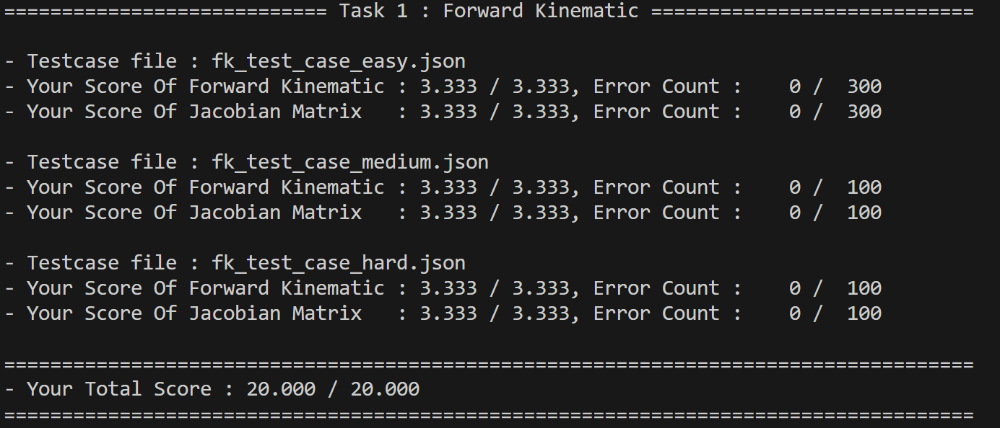
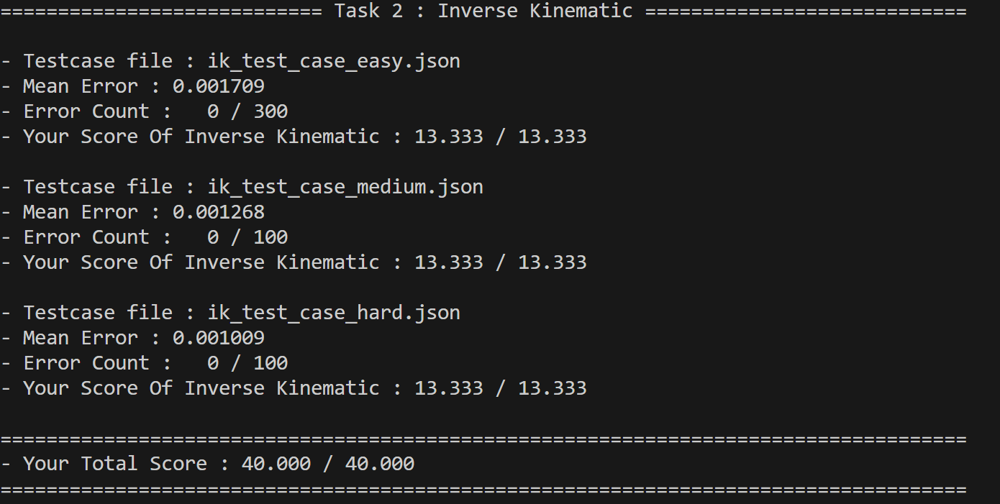
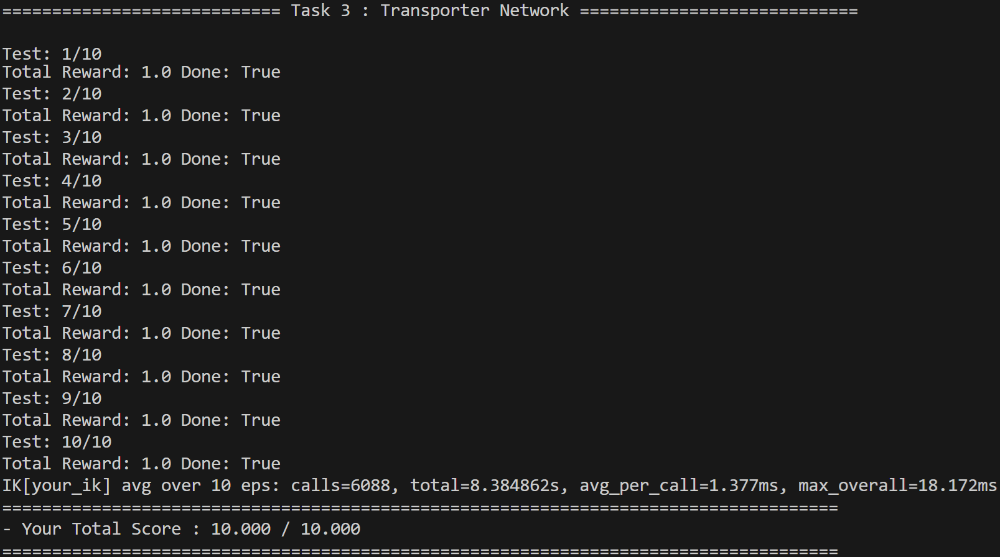
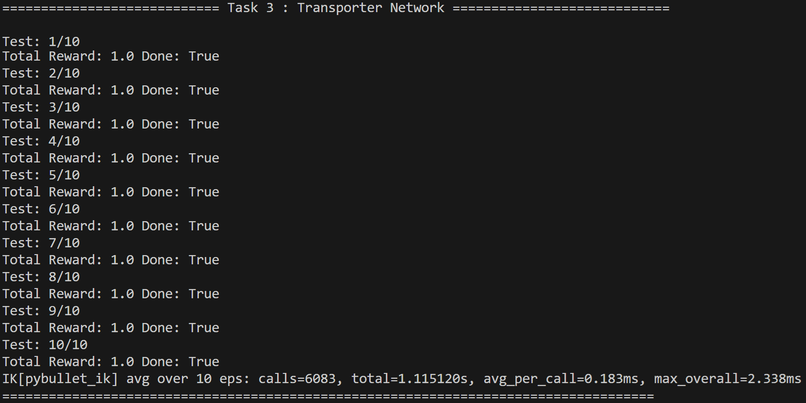

# Homework 3: A Robot Manipulation Framework

## 1. Task 1 — Forward kinematics

### 1.1 Briefly explain how you implement your_fk() function

* Build the 4×4 homogeneous transform for each link using the **classic D-H** order
  $T_i = R_z(\theta_i);T_z(d_i);T_x(a_i);R_x(\alpha_i)$, and multiply them from the world→base transform `A` onward. The code computes each `T_i` and accumulates `T = T @ T_i`. 

* While accumulating transforms **recording each joint frame origin** and the **joint z-axis** so we can later compute the geometric Jacobian. 

* After the loop extracting the end-effector position `p_e` and compute the Jacobian columns for revolute joints:

  * linear part $J_v^i = z_i \times (p_e - o_i)$
  * angular part $J_\omega^i = z_i$.
    The implementation directly fills `jacobian[:3,i]` and `jacobian[3:,i]`. 

* Finally an “adjustment” rotation is applied to match simulator conventions, the 4×4 `A` is converted to a 7D pose `(x,y,z,qx,qy,qz,qw)`, and the function returns `(pose_7d, jacobian)`. 

#### Code from `fk.py`

```python
# build per-joint transform (classic DH)
T_i = rot_z(theta_i) @ trans_z(d_i) @ trans_x(a_i) @ rot_x(alpha_i)
T = T @ T_i

# store world-frame origin and z-axis
origins.append(T[:3, 3].copy())
z_axes.append(T[:3, 2].copy())

# Jacobian (geometric) for revolute joints
p_e = origins[-1]
for i in range(6):
    z = z_axes[i]; p_i = origins[i]
    Jv = np.cross(z, (p_e - p_i)); Jw = z
    jacobian[:3, i] = Jv; jacobian[3:, i] = Jw
```


### 1.2 What is the difference between D-H convention and Craig’s convention (Modified D-H Conveition)?

* **Classic D-H (used in code):** each link transform is
  $A_i = R_z(\theta_i);T_z(d_i);T_x(a_i);R_x(\alpha_i)$. Frames are attached so that parameters $a_i,\alpha_i$ refer to link *i*, while $\theta_i, d_i$ are joint variables around/along $z_{i-1}$.

* **Modified (Craig’s) D-H:** the order of elementary operations is changed to
  $A_i = R_x(\alpha_{i-1});T_x(a_{i-1});R_z(\theta_i);T_z(d_i)$. In practice this means frames are placed differently.
* The two conventions produce different numeric transforms for the same parameter table.


### 1.3 Complete the D-H table in your report following D-H convention

The template is provided in `get_ur5_DH_params()`:

| Joint (i) | a (m)   | d (m)   | α (rad) | θ (variable) |
| --------- | ------- | ------- | ------- | ------------ |
| 1         | 0.0000  | 0.08920 | +π/2    | θ₁           |
| 2         | -0.4250 | 0.00000 | 0       | θ₂           |
| 3         | -0.3920 | 0.00000 | 0       | θ₃           |
| 4         | 0.0000  | 0.10930 | +π/2    | θ₄           |
| 5         | 0.0000  | 0.09475 | -π/2    | θ₅           |
| 6         | 0.0000  | 0.20230 | 0       | θ₆           |
| 7         | 0.0000  | 0.00000 | 0       | 0            |

### 1.4 Result



## 2. Task 2 — Inverse kinematics

### 2.1 Briefly explain how you implement your_ik() function

* Compute current end-effector pose and geometric Jacobian `J` by calling `your_fk()`. 
* Form a 6D error vector `e = [w_pos * (tgt_pos - cur_pos), w_ori * e_ori]` where `e_ori` is the rotation vector from current orientation to target.
* Compute DLS pseudo-inverse as $J^+ = J^T (J J^T + \lambda^2 I)^{-1}$ and the joint update $\Delta q = \alpha J^+ e$. 
* Limit per-iteration step size (`max_step`) and clamp joints to joint limits after each update. 

### Code from `ik.py`

```python
# orientation error (ensure shortest path)
cq = np.array(cur_quat); tq = np.array(tgt_quat)
if np.dot(cq, tq) < 0.0: tq = -tq
R_err = R.from_quat(tq) * R.from_quat(cq).inv()
e_ori = R_err.as_rotvec()
# stack task error
e = np.hstack([w_pos * (tgt_pos - cur_pos), w_ori * e_ori])
# DLS pseudo-inverse
JJt = J @ J.T
J_pinv = J.T @ np.linalg.inv(JJt + (damping**2)*np.eye(JJt.shape[0]))
dq = alpha * (J_pinv @ e)
# clip step & joint limits
dq = np.clip(dq, -max_step, max_step)
q = np.clip(q + dq, joint_limits[:,0], joint_limits[:,1])
```


### 2.2 What problems do you encounter and how do you deal with them?

1. **Singularities / ill-conditioned Jacobian:**

   * Problem: near singular robot configurations the matrix $J J^T$ can be nearly singular and the Moore–Penrose inverse becomes unstable.
   * Fix: use **Damped Least Squares** (add $\lambda^2 I$ to $J J^T$) before inversion. The small damping `damping=1e-3` regularizes the inversion and reduces extreme joint steps. 

2. **Large / unstable joint updates:**

   * Problem: raw pseudoinverse sometimes produces large `Δq` and overshoots.
   * Fix:
     scale update by `alpha` (step size) and clip each component to `[-max_step, max_step]` per iteration to avoid large jumps.  


### 2.3 Bonus

None

### 2.4 Result



## 3. Task 3 — Transporter Network

### 3.1 Compare your results between your_ik function and pybullet_ik






`pybullet_ik` is much faster with lower latency spikes, while `your_ik` incurs higher average and worst-case solve times.

